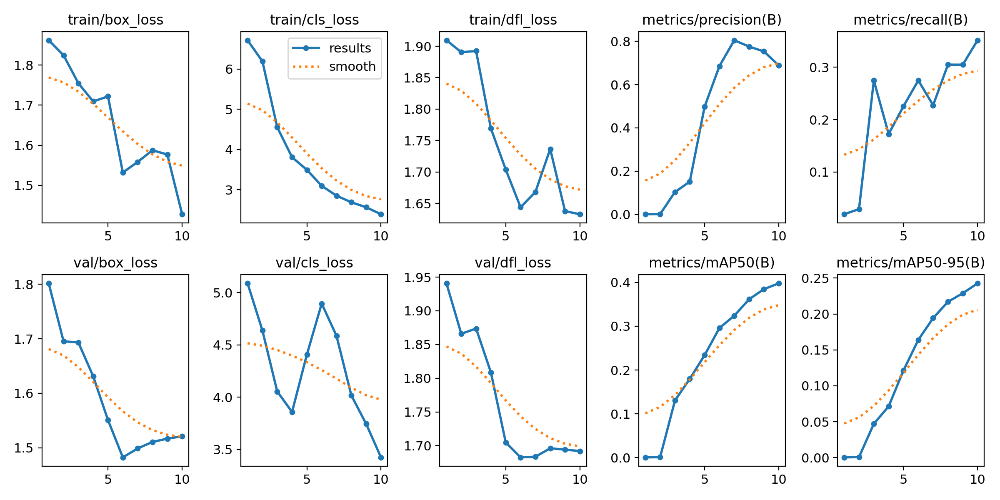

# Computer Vision for Smart Interaction


This repository contains a custom YOLOv8-based object detection solution for recognizing real-world objects in an Airbnb-like setting. It supports offline training on a custom dataset and real-time inference via a Streamlit web app.

---

## 📋 Table of Contents

* [Project Overview](#project-overview)
* [Dataset](#dataset)
* [Approach & Methodology](#approach--methodology)
* [Folder Structure](#folder-structure)
* [Installation](#installation)
* [Training](#training)
* [Testing](#testing)
* [Real-time Detection (Streamlit App)](#real-time-detection-streamlit-app)
* [Results](#results)
* [Performance Metrics](#performance-metrics)
* [Next Steps](#next-steps)

---


## Project Overview

* **Goal**: Train a lightweight YOLOv8s model to detect items and room layouts in an Airbnb-style dataset, optimized for efficiency on low-resource devices.
* **Key Features**:
  * Custom dataset sourced from [Roboflow – Airbnb Collection](https://universe.roboflow.com/robin-mortier/airbnb).
  * Real-time webcam inference via a Streamlit web interface.
  * Simple training and testing scripts for rapid experimentation.

---

## Dataset

* **Source**: Roboflow Universe ([https://universe.roboflow.com/robin-mortier/airbnb](https://universe.roboflow.com/robin-mortier/airbnb))
* **Format**: YOLO-format annotations (`data.yaml` defines class names and paths).
* **Splits**:

  * `train/` — Training images and labels
  * `valid/` — Validation images and labels

---

## Approach & Methodology

1. **Model Selection**: Chose the compact `yolov8s` architecture for fast inference and lower resource consumption.
2. **Training Pipeline**:

   * Load pretrained `yolov8s.pt` weights.
   * Configure `data.yaml` with dataset paths and class labels.
   * Train for 10 epochs.
3. **Inference**:

   * Batch testing via `test.py` on sample images.
   * Real-time frame-by-frame detection in Streamlit using `streamlit_webrtc`.
4. **Optimization**:

   * Adjust confidence threshold via sidebar control for filtering weak detections.
   * Run asynchronous transforms for minimal latency.

---

## Folder Structure

```
├── data.yaml             # Dataset config for YOLOv8
├── train.py              # Training script
├── test.py               # Offline inference script
├── app.py                # Streamlit real-time detection app
├── runs/                 # Training and evaluation outputs
│   ├── detect/train/     # Training logs, metrics, plots
│   └── detect/weights/   # Saved YOLO weights (best.pt, last.pt)
├── train/                # Training images and labels
├── valid/                # Validation images and labels
├── test_sample.jpg       # Sample image for offline testing
└── README.md             # This documentation
```

---

## Installation

1. **Ignore Virtual Environment**: Create a `.gitignore` file (if not present) in the project root and add:

   ```gitignore
   venv/
   ```

   This ensures your local `venv` folder is not pushed to GitHub.

2. Clone this repository:

   ```bash
   git clone https://github.com/your-username/airbnb-object-detection.git
   cd airbnb-object-detection
   ```

3. Create a virtual environment and install dependencies:

   ```bash
   python3 -m venv venv
   source venv/bin/activate   # On Windows use `venv\Scripts\activate`
   pip install -r requirements.txt
   ```

> **Dependencies**: ultralytics, streamlit, streamlit-webrtc, av, numpy

---

## Training

Train your custom YOLOv8 model using:

```bash
python train.py --data data.yaml --epochs 10
```

* Model weights will be saved in `runs/detect/train/weights/best.pt`.
* Training logs, loss curves, and performance plots are available under `runs/detect/train/`.

---


## Testing


Run inference on a static image:

```bash
python test.py --weights runs/detect/train/weights/best.pt --source test_sample.jpg
```

* The result will be displayed in a window and saved as `detected_output.jpg`.

---


## Real-time Detection (Streamlit App)

Launch the Streamlit application to perform webcam-based detection:

```bash
streamlit run app.py
```

* Access the UI at `http://localhost:8501/`.
* Use the sidebar slider to adjust the confidence threshold.

---

## Results

* **Training Visualizations**: Loss curves, precision-recall (PR) curves, confusion matrix, etc.
* **Inference Demos**: `detected_output.jpg`, live webcam feed screenshots.



---

## Performance Metrics


> Detailed metric plots are available in `runs/detect/train/`.

---

## Next Steps

* Increase the number of training epochs and augment the dataset for improved accuracy.
* Experiment with larger YOLOv8 variants (`yolov8m`, `yolov8l`).
* Deploy the Streamlit app to a cloud platform with GPU support.
* Integrate alert or automation for detected objects (e.g., smart home triggers).

---


